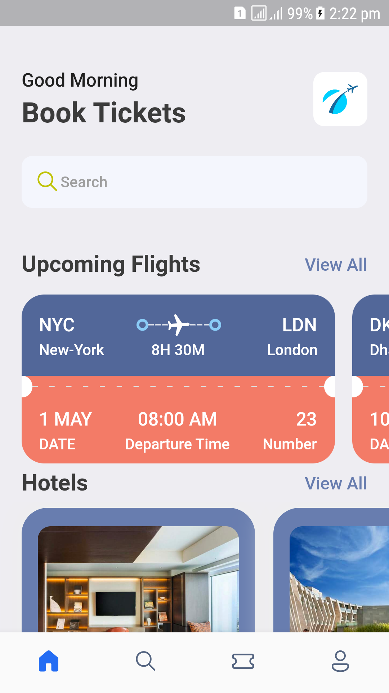
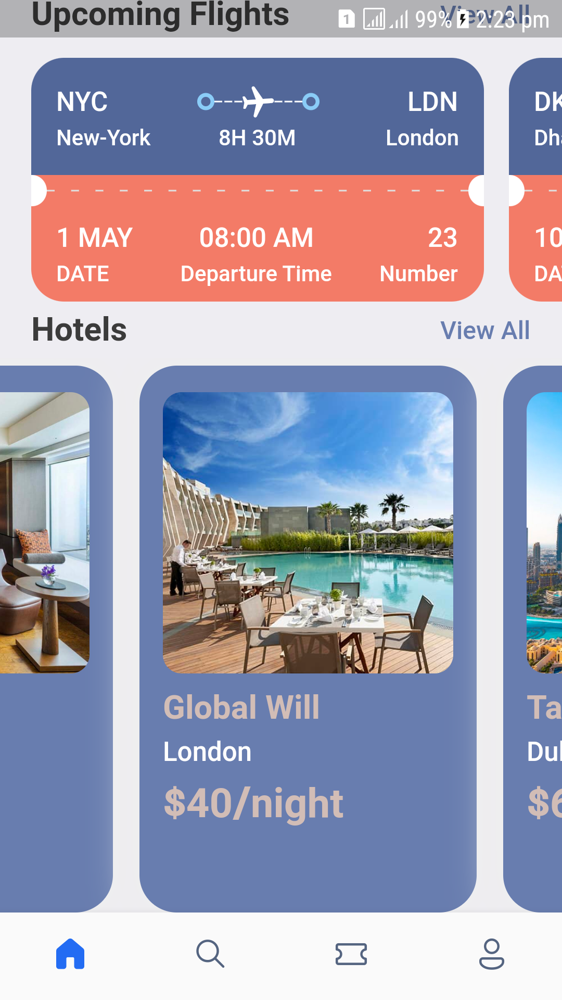
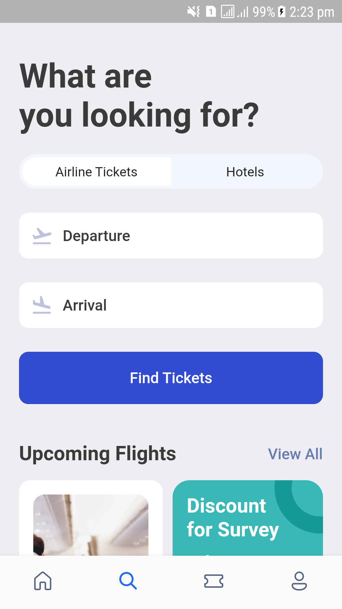
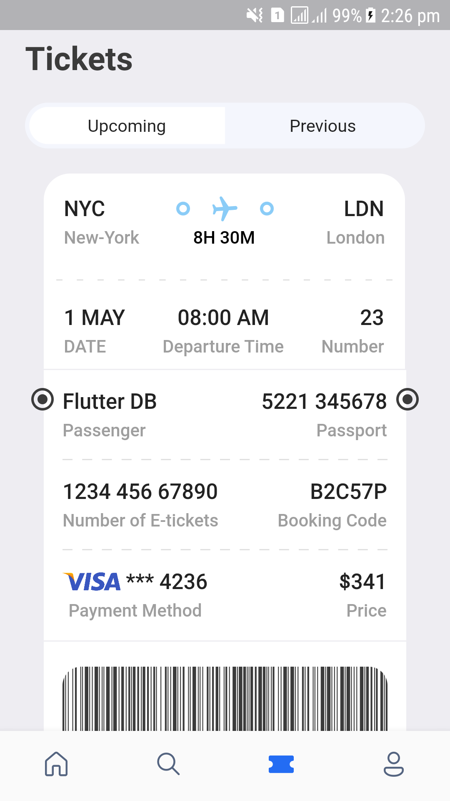
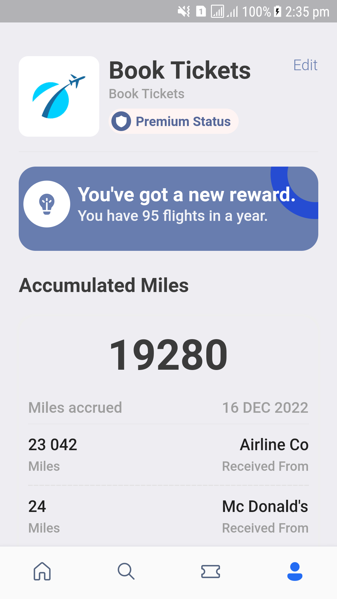

# Carni

A Flutter ticket app project to showcase best practices in UI design and code.

## Getting Started

This project is a for demonstrating UI design for a Flutter application.
## Give it a star if you like it.
below are some screenshots:

<table>
<tr>
  <th>HomeScreen</th>
  <th>HomeScreen2</th>
  <th>SearchScreen</th>
 </tr>
  <tr>
    <td> </td>
    <td></td>
    <td></td>
  </tr>
  <tr>
    <th>SearchScreen2</th>
      <th>TicketScreen</th>
      <th>ProfileScreen</th>
  </tr>
  <tr>
     <td></td>
     <td></td>
     <td></td>
  </tr>
</table>

